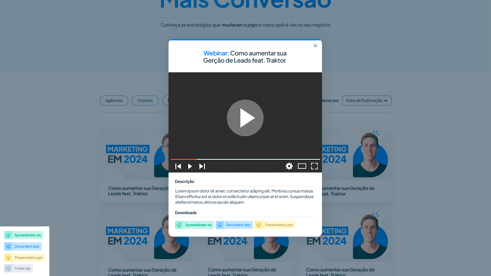

# **Projeto: Leadster Test - Dev (Lucas Vieira)**
Teste Leadster: Construção de uma <b>Landing Page</b> para processo seletivo

</br>

### Link do Deploy na Vercel: https://leadster-test-theta.vercel.app/

</br>

## Layout da Landing Page


#


## Decisões Tomadas

- Manipulação da lógica das animações via servidor next

  📌 **Processo de tomada da decisão**: o uso de animações via client side estava gerando conflito entre as classes geradas pelo styled-componentes no servidor e no cliente, entretanto as configs para alinhamento entre o Next e o Styled-Components estavam corretas, por isso optei pela abordagem de manipular a lógica da animação externamente a um componente

- Uso de uma lib de terceiro para o componente de Player de vídeo
- E uso de uma lib de terceiro para o elememento modal

  📌 **Processo de tomada da decisão**: fiz o uso dessas libs para acelerar o processo de desenvolvimento, fiz uma estimativa de prazo que acabou se demonstrando apertada, no entanto foi possível ainda fazer o **deploy** e enviar um email a Leadster no dia que informei minha conclusão, apesar de ainda querer fazer mais melhorias e implementar testes

- Distinção entre Componentes e Elementos

📌 **Processo de tomada da decisão**: optei por realizar uma organização mais abstraída na distinção de Componentes e Elementos, visando a reutilização dos elementos e a escalabilidade na da aplicação futuramente

- Uso de hooks personalizados

📌 **Processo de tomada da decisão**: os hooks personalizados demonstram uma boa organização de código pois consigo realizar muitas funcionalidades sem poluir meus componentes, e por isso tomei a decisão de utilizá-los nas features que exigiam certa grande quantidade de código ou otimização

</br>

## Organização do Código

- Os **componentes** decidi armazená-los em pastas com um arquivo tsx e um ts para os estilos
- Os **elementos** também em pastas, mas apenas com o arquivo ts do styled-components
- Nos componentes no topo deixei apenas as declarações de váriaveis de estado e outras váriaveis, abaixo deixei o hook de efeito colateral (useEffect), logo após outras funções de lógica de interface, e na última camada as arrow's functions de tratamento de eventos (handle functions)

</br>

## Features
- Execução de vídeo em modal
- Animações CSS
- Paginação

</br>

## Instruções de Execução do Projeto

#

### **AMBIENTE DE DESENVOLVIMENTO**

Primeiro, clone este reposiótio:

```bash
$ git clone git@github.com:lkasvr/leadster-test.git
```
Depois, execute os comandos abaixo na raíz do projeto:

```bash
npm install
```

```bash
npm run dev
```

</br>

### **AMBIENTE DE PRODUÇÃO**

Após os comandos acima, para simular a execução em produção execute os seguintes comandos:

```bash
npm run build
# e
npm run start
```

</br>

### **DOCKER CONTAINER**
<font color="red">**ATENÇÃO**: para este passo certifique-se de ter o **Docker** instalado em sua máquina! </font>
</br>
</br>
Para facilitar, já deixei uma imagem docker (pública) no **Docker Hub** que você poderá utilizar na sua máquina para subir um container.

</br>

Para tanto, é necessário executar os seguintes comandos:

```bash
docker pull lkasvr/leadster-test:latest
```

Agora execute o um container da image:
```bash
docker run -d -p [3000:3000] lkasvr/leadster-test:latest
```

<font color="red">**ATENÇÃO**: para este passo certifique-se de realizar o bind de portas, para uma porta disponível na sua máquina **[porta-seu-pc-:porta-container]** </font>

</br>

#

## Padrão de Commit's

`git commit -m "[título] - [categorias de edição[...]] - [descrição sucinta das alterações]"`

### Regras de padronização
1. Máximo de 3 categorias de edição por commit
2. O **[título]** não deve exceder 5 palavras
3. **Se houver**, o título deve explicitar uma decisão
4. Nenhum dos insertos categorias: **[título], [categoria], [desc]** são opcionais
5. A categoria **[CMO]** obrigatoriamente necessita da explicitação do motivo ou uma explicação
6. O motivo ou explicação do item 5, é realizado na descrição do commit

### Categorias de Edição de Código
* **Bugf** - Bug fix / correção de bug's
* **Lay** - Inserção/Edição de layout
* **Lon** - Inserção/Edição de lógica negocial
* **Loi** - Inserção/Edição de lógica de interface
* **CMO** - Edição genérica do código com explicitação obrigatória do motivo/explicação
* **Ret** - Retificação e aperfeiçoamento ou pequenas e genéricas edições de código sem modificação de lógicas
